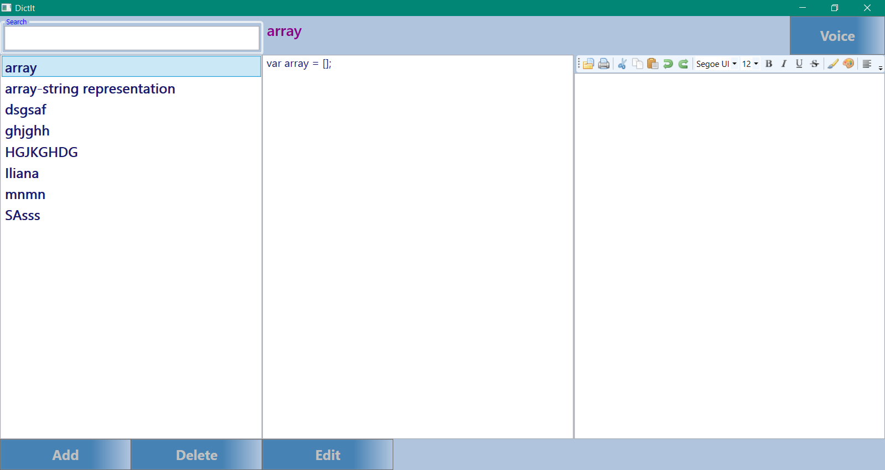

# DictIt

.NET WPF application - a smart dictionary.

It stores information in xml file. The user could add, delete and edit the data. Also could play definition speech.
This app is a very good example of MVVM architecture and data binding.
